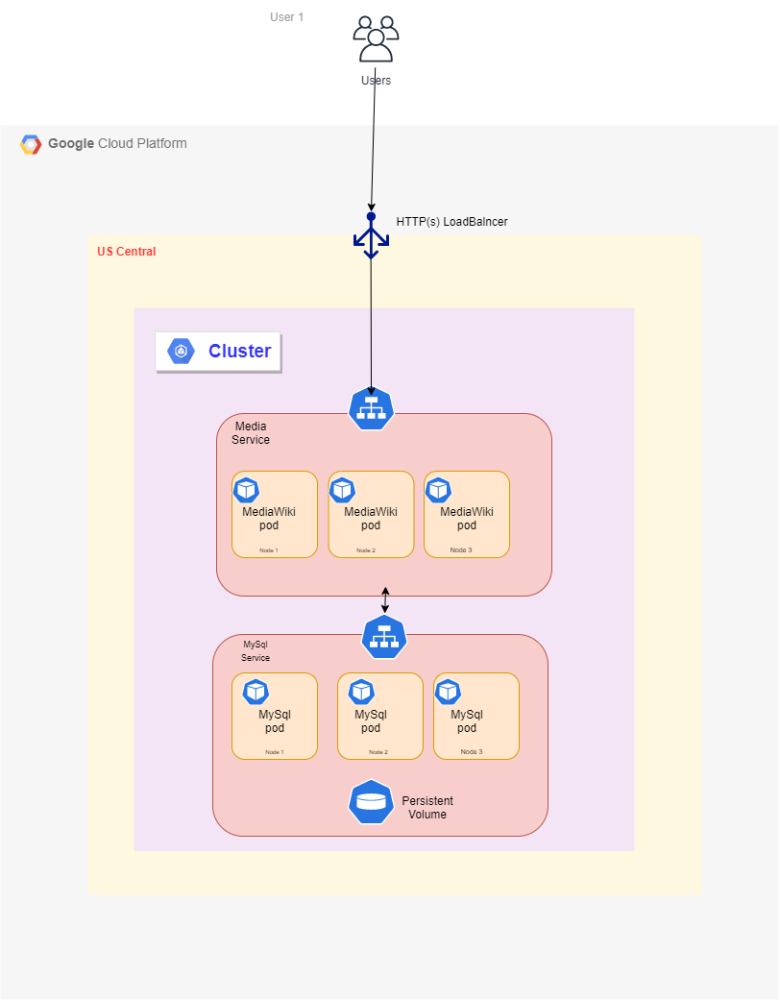
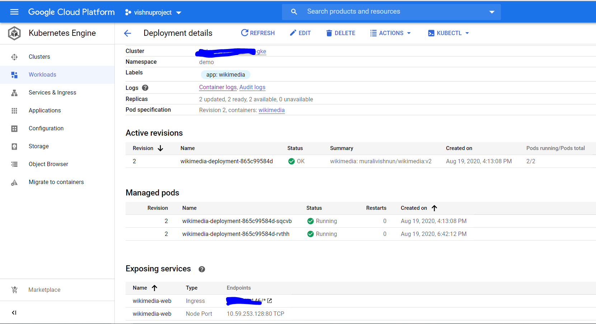
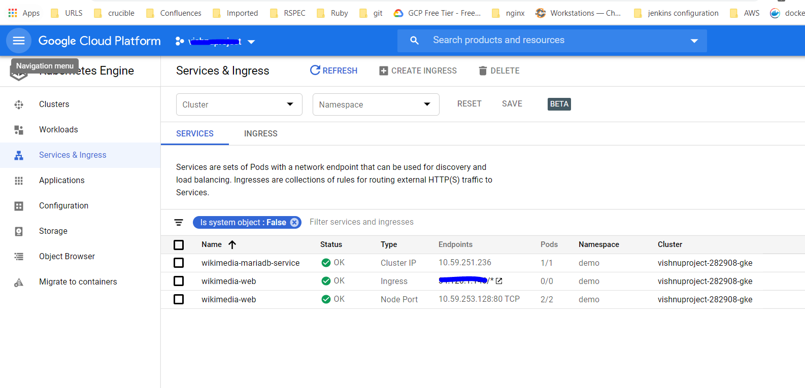
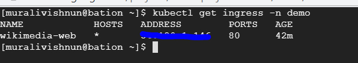
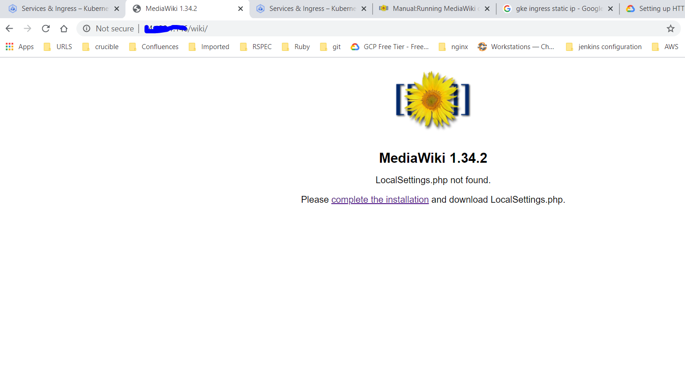
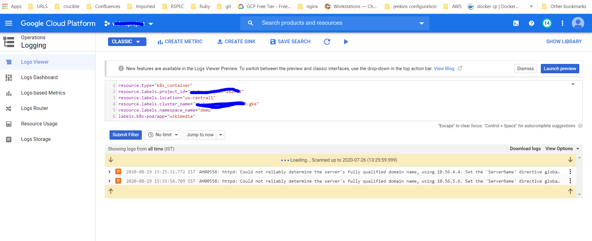

# Deploy Mediawiki appilication into GKE
In this project, We are using GKE, Terraform, Docker and helm

```
1. Google Kubernetes Engine (GKE) is a management and orchestration system for Docker container and container clusters that run within Google's public cloud services.
2. Terraform is infrastructure management tool
3. Docker is an open platform for developing, shipping, and running applications. Docker enables you to separate your applications from your infrastructure so you can deliver software quickly. With Docker, you can manage your infrastructure in the same ways you manage your applications 
4. helm is a package manager for kubernetes
```

## Prerequisites
1. Need a GCP account.
2. Install GIT, Terraform(v0.12), Helm(v2.15.2) and kubectl tools on GCP bastion Machine.
3. Perform below commands from GCP bastion Machine.
```
$ gcloud init
$ gcloud auth application-default login
```

### Application depolyement
1. Architecture diagram
2. Create GKE cluster using Terraform
3. Deploy the wikimedia using Helm

### 1. Architecture diagram



### 2 Create GKE cluster using Terraform
1. Clone the current repo 
```
git clone https://github.com/muralivishnn/wikimedia.git

```

2. Move into Terraform directory
```
cd wikimedia/terraform/

```

3. Run the Terraform script
```
terraform apply --var-file=terraform.tfvars

```
Need to specify the project_id,region and master_authorized_network_cidr at `terraform.tfvars` file.

4. To configure kubetcl, by running the following command.
```
gcloud container clusters get-credentials <Project-ID>-gke --region us-central1

```

### 3. Deploy the wikimedia using Helm
1. Move into Terraform directory
```
cd wikimedia
```

Doker Images: https://hub.docker.com/repository/docker/muralivishnun/wikimedia/tags

2. Run the below commands to deploy Mediawiki with helm
```
helm package wikimedia
helm install wikimedia-0.1.0.tgz --name wikimedia --namespace demo

NOTE: Update required values in values.yaml
```

3. validate the deployments
```
You can access the application at http://{GKE ingress publicip}:80/wiki

We can get GKE ingress publicip using below command

$ kubectl get ingress -n demo
NAME            HOSTS   ADDRESS        PORTS   AGE
wikimedia-web   *       x.x.x.x        80      70m
```

4. We can view the logs of application in GCP Logging.

### SAMPLE OUT PUTS
1. Deployments Staus in GKE


2. Service and Ingress Status


3. External IP of Ingress


4. MediaWiki Web Page using ExternalIP


5. Application Log monitoring using GCP Logging

